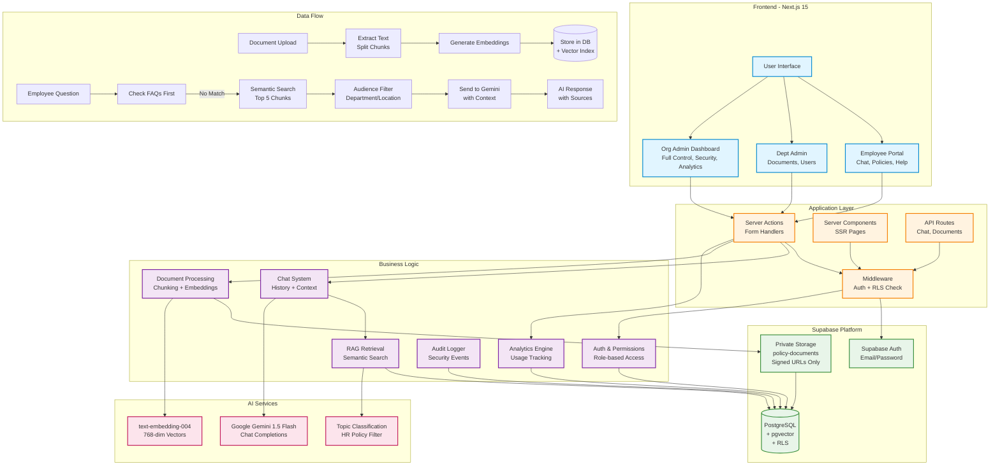

# PolicyPal AI 🤖

**Secure Internal Company Policy Assistant** - Ask questions, get instant answers from your company's policy documents using AI.

[](https://nextjs.org/)
[](https://www.typescriptlang.org/)
[](https://supabase.com/)
[](LICENSE)

---

## 🎯 Problem Solved

Employees spend hours searching through:
- 📄 Long PDF policy documents
- 📧 Email threads with HR
- 💬 Slack messages for policy questions
- 📚 Outdated wiki pages

**PolicyPal AI solves this** by providing:
- ✨ Instant AI-powered answers to policy questions
- 🔒 Secure, role-based document access
- 🎯 Audience-targeted content (department, location, employment type)
- 📊 HR-approved FAQs for common questions
- 🔍 Full audit logging for compliance

---

## ✨ Features

### For Employees
- 💬 **Chat Interface** - Ask questions in natural language
- ⚡ **Instant Answers** - FAQ-first, then AI retrieval
- 🧠 **Context-Aware Responses** - Remembers conversation history (NEW)
- 📚 **Source Citations** - See which documents answered your question
- 🔒 **Secure Access** - Only see documents you're authorized for
- 🛡️ **Smart Guardrails** - Only HR policy questions allowed (NEW)

### For HR Admins
- 📤 **Upload Policy Documents** - Drag-and-drop PDFs
- 🎯 **Audience Targeting** - Restrict by department, location, or employment type
- ❓ **Manage FAQs** - Create HR-approved answers for common questions
- 👥 **User Management** - Invite-based onboarding, role assignment
- 📊 **Analytics** - Track questions, document usage, user engagement
- 🛡️ **Security Dashboard** - Monitor access, view audit logs
- 📝 **Audit Logs** - Track all actions (uploads, invites, questions)
- 🔍 **Topic Analytics** - See what topics employees ask about (NEW)

### Security Features
- 🔐 **Private Storage** - All PDFs in private bucket, signed URLs only
- 🔑 **Row Level Security (RLS)** - Organization-level data isolation
- 👤 **Invite-Only Onboarding** - No self-service role assignment
- 🎫 **Role-Based Access** - ORG_ADMIN, DEPARTMENT_ADMIN, EMPLOYEE
- 🚫 **Content Filtering** - AI sees only audience-allowed chunks
- ⏱️ **Rate Limiting** - 20 questions/hour, 30 signed URLs/hour
- 📋 **Audit Logging** - Track all security-relevant actions

---

## 🏗️ Tech Stack

### Frontend
- **Next.js 15** - React framework with App Router
- **React 19** - UI library
- **TypeScript 5.9** - Type safety
- **Tailwind CSS 3.4** - Styling
- **shadcn/ui** - UI components
- **Lucide Icons** - Icon library

### Backend
- **Supabase** - Authentication, PostgreSQL database, Storage
- **PostgreSQL** - Relational database with pgvector
- **pgvector** - Vector embeddings for semantic search
- **Row Level Security (RLS)** - Database-level authorization

### AI & Embeddings
- **Google Gemini 1.5 Flash** - Chat completions & topic classification
- **text-embedding-004** - 768-dim embeddings
- **RAG (Retrieval Augmented Generation)** - Context-aware answers
- **Conversation Memory** - Multi-turn context (last 5 turns) (NEW)
- **Topic Guardrails** - Prevents off-topic questions (NEW)

---

## 📊 Architecture

### System Architecture Diagram



### Simplified Architecture

```
┌─────────────────────────────────────────────────────────────┐
│                      User Interface                         │
│  ┌──────────────┐  ┌──────────────┐  ┌──────────────┐     │
│  │   Employee   │  │  Dept Admin  │  │  Org Admin   │     │
│  │     Chat     │  │   Dashboard  │  │   Dashboard  │     │
│  └──────────────┘  └──────────────┘  └──────────────┘     │
└────────────┬──────────────┬──────────────┬─────────────────┘
             │              │              │
    ┌────────▼──────────────▼──────────────▼────────┐
    │         Next.js App Router                     │
    │  ┌────────┐ ┌────────┐ ┌────────┐            │
    │  │ Server │ │ Server │ │  API   │            │
    │  │ Actions│ │  Comp  │ │ Routes │            │
    │  └────────┘ └────────┘ └────────┘            │
    └────┬────────────┬────────────┬────────────────┘
         │            │            │
    ┌────▼────────────▼────────────▼────┐
    │      Supabase Platform             │
    │  ┌──────────┐  ┌──────────────┐   │
    │  │   Auth   │  │  PostgreSQL  │   │
    │  │ + RLS    │  │  + pgvector  │   │
    │  └──────────┘  └──────────────┘   │
    │  ┌──────────────────────────────┐ │
    │  │   Private Storage Bucket     │ │
    │  │   (Signed URLs only)         │ │
    │  └──────────────────────────────┘ │
    └────────────────┬───────────────────┘
                     │
            ┌────────▼────────┐
            │  Google Gemini  │
            │  (LLM + Embed)  │
            └─────────────────┘
```

### Data Flow

**Document Upload → AI Answers:**
1. Admin uploads PDF
2. System extracts text and creates chunks
3. Generate vector embeddings (768-dim)
4. Store chunks + embeddings in PostgreSQL
5. Employee asks question
6. Check HR-approved FAQs first
7. Semantic search finds relevant chunks
8. Filter by audience (department/location)
9. Send top 5 chunks to Gemini as context
10. Return AI answer with source citations

---

## 🎬 Demo Videos

Watch PolicyPal AI in action! We use Playwright to capture real user workflows.

### Available Demo Videos

#### 🔐 Authentication & Access Control
- Employee login and dashboard navigation
- Admin login and role-based access
- Invite-based onboarding flow

#### 💬 Employee Experience  
- Asking HR policy questions
- Viewing chat history
- Browsing policy documents
- Requesting clarifications from HR

#### 👥 Admin Features
- Uploading and processing documents
- Managing users and invitations
- Viewing analytics and insights
- Handling employee clarifications
- Reviewing security audit logs

### Generating Demo Videos

Videos are automatically recorded during E2E tests:

```bash
# Record auth flow demos (login, navigation)
npm run test:demo

# Record all feature demos (full workflows)
npm run test:demo:all

# Videos saved to: test-results/*/video.webm
```

**Configuration:**
- Resolution: 1280x720 (HD)
- Format: WebM
- Location: `test-results/[test-name]/video.webm`
- Recording: Set `RECORD_VIDEO=true` environment variable

### Using Demo Videos

1. **In Documentation:** Embed in README or docs
2. **In Presentations:** Show actual app workflows
3. **For Testing:** Visual regression testing
4. **For Onboarding:** New team member training

**Note:** Videos are gitignored to keep repo size small. Generate fresh demos as needed.

---

## 🔒 Security Model

### Authentication Flow
1. **Public Registration** → Creates ORG_ADMIN for new organization
2. **Invite-Based** → All other users invited by admins
3. **No Role Self-Selection** → Roles assigned via invitation
4. **Email/Password** → Supabase Auth (future: SSO)

### Authorization Model
```
ORG_ADMIN
├── Full organizational control
├── Manage all users
├── Upload/manage documents
├── View security dashboard
├── Manage FAQs
└── Bypass audience restrictions

DEPARTMENT_ADMIN
├── Limited admin access
├── Can only invite EMPLOYEE role
├── Upload/manage documents
├── View limited audit logs
└── Bypass audience restrictions

EMPLOYEE
├── Chat interface only
├── Ask questions
├── View allowed documents
└── Filtered by audience targeting
```

### Document Security
1. **Private Bucket** - No public access
2. **Signed URLs** - 10-minute expiry
3. **Permission Checks** - Before URL generation
4. **Audience Filtering** - Department, location, employment type
5. **Audit Logging** - Track all access

### AI Security
1. **No Full PDFs** - Only 2000-char chunks sent to LLM
2. **Audience Filtering** - AI sees only allowed chunks
3. **Max 5 Chunks** - Per query
4. **FAQ Priority** - HR-approved answers first
5. **Rate Limiting** - 20 questions/hour

---

## 🚀 Quick Start

### Prerequisites
- **Node.js 18+** installed
- **Supabase account** (free tier works)
- **Google Gemini API key** ([get here](https://aistudio.google.com/app/apikey))

### 1. Clone & Install

```bash
git clone <your-repo-url>
cd PolicyAi
npm install
```

### 2. Set Up Supabase

#### Create Project
1. Go to [supabase.com](https://supabase.com)
2. Click "New Project"
3. Choose a name, region, and database password
4. Wait 2-3 minutes for setup

#### Run Migrations
1. Go to **SQL Editor** in Supabase dashboard
2. Create new query
3. Copy contents from [`supabase/migrations/`](supabase/migrations/) folder
4. Start with `supabase-migration.sql` (base schema)
5. Run migrations in order: step2, step3, step4, step5, step6, step8
6. Run fix migrations: `fix-recursion.sql`, `audit-logs.sql`, `onboarding.sql`

#### Create Storage Bucket
1. Go to **Storage** in Supabase dashboard
2. Click "New Bucket"
3. Name: `policy-documents`
4. **IMPORTANT**: Set to PRIVATE (not public)
5. Save

### 3. Configure Environment Variables

Create `.env.local`:

```env
# Supabase
NEXT_PUBLIC_SUPABASE_URL=https://your-project.supabase.co
NEXT_PUBLIC_SUPABASE_ANON_KEY=your-anon-key
SUPABASE_SERVICE_ROLE_KEY=your-service-role-key

# AI
GEMINI_API_KEY=your-gemini-api-key

# App
NEXT_PUBLIC_APP_URL=http://localhost:3000
```

### 4. Run Development Server

```bash
npm run dev
```

Visit **http://localhost:3000**

---

## 📝 Database Schema

### Core Tables
- `organizations` - Multi-tenant organizations
- `profiles` - User profiles with role and department
- `policy_documents` - Uploaded PDFs with audience rules
- `policy_document_chunks` - Text chunks with embeddings (768-dim)
- `chat_sessions` - User conversation threads
- `chat_messages` - Individual messages with sources
- `approved_faqs` - HR-approved Q&A with audience targeting
- `audit_logs` - Security and action tracking
- `rate_limits` - Per-user rate limiting

### RLS Policies
All tables enforce organization-level isolation via Row Level Security.

---

## 👥 User Roles

### ORG_ADMIN
- First user created during organization registration
- Full control over organization
- Can invite any role
- Access to security dashboard

### DEPARTMENT_ADMIN
- Invited by ORG_ADMIN
- Limited admin access
- Can only invite EMPLOYEE role
- Scoped to specific department (HR, FINANCE, IT, OPS, LEGAL)

### EMPLOYEE
- Invited by ORG_ADMIN or DEPARTMENT_ADMIN
- Chat interface only
- Filtered document access
- No admin features

---

## 🎭 Demo Mode

See [`docs/DEMO_SETUP.md`](docs/DEMO_SETUP.md) for full instructions.

### Quick Demo Credentials

```
Demo Admin:
  Email: demo-admin@democorp.com
  Password: Demo123!@#

Demo Employee:
  Email: demo-employee@democorp.com
  Password: Demo123!@#
```

---

## 🛠️ Development

### Project Structure

```
PolicyAi/
├── app/                      # Next.js 15 App Router
│   ├── (auth)/              # Auth pages (login, register)
│   ├── admin/               # Admin dashboard
│   │   ├── clarifications/  # HR clarification requests
│   │   ├── documents/       # Document management (with embeddings)
│   │   ├── users/           # User management
│   │   ├── approved-faqs/   # FAQ management
│   │   ├── audit-logs/      # Audit log viewer
│   │   └── security/        # Security dashboard
│   ├── employee/            # Employee portal
│   │   ├── chat/           # Policy chat interface
│   │   └── clarifications/ # My clarification requests
│   └── api/                 # API routes
├── components/              # React components (organized by feature)
├── docs/                    # 📚 All documentation (NEW)
│   ├── STRUCTURE.md        # Detailed project structure guide
│   ├── PHASE1_COMPLETE.md  # Phase 1 implementation summary
│   ├── PHASE2_COMPLETE.md  # Phase 2 implementation summary
│   └── ...                  # Other documentation
├── lib/                     # Business logic (feature-based)
│   ├── ai/                 # AI & embeddings
│   ├── analytics/          # Analytics queries
│   ├── auth/               # Authentication & permissions
│   ├── chat/               # Chat system (with history)
│   ├── clarifications/     # HR clarifications (with pagination)
│   ├── documents/          # Document management (with embeddings)
│   ├── faq/                # FAQ system
│   ├── processing/         # Document processing
│   └── supabase/           # Supabase clients
├── supabase/               # Database
│   └── migrations/         # 🗄️ All SQL migrations (NEW)
└── types/                  # TypeScript definitions
```

**📖 For detailed structure explanation, see [`docs/STRUCTURE.md`](docs/STRUCTURE.md)**

### Key Files
- `lib/auth/permissions.ts` - Role-based access control
- `lib/ai/embeddings.ts` - Vector embedding generation
- `lib/ai/semantic-retrieval.ts` - RAG retrieval logic
- `lib/chat/history-actions.ts` - Chat history persistence (Phase 2)
- `lib/clarifications/actions.ts` - Clarification CRUD + pagination
- `lib/documents/embedding-actions.ts` - Manual embedding generation (Phase 2)
- `lib/processing/process-document.ts` - Document processor (auto-embeds)
- `lib/audit/audit-logs.ts` - Audit logging system

### Commands

```bash
# Development
npm run dev              # Start dev server (localhost:3000)
npm run build            # Build for production
npm run start            # Start production server

# Code Quality
npm run lint             # Run ESLint
npx tsc --noEmit         # TypeScript type checking

# Database
# Run migrations in Supabase SQL Editor
```

---

## 🚀 Deployment

See [DEPLOYMENT_CHECKLIST.md](DEPLOYMENT_CHECKLIST.md) for comprehensive pre-deployment checks.

### Deploy to Vercel

```bash
# Install Vercel CLI
npm i -g vercel

# Deploy
vercel --prod
```

### Environment Variables (Production)
Set these in your hosting platform:
- `NEXT_PUBLIC_SUPABASE_URL`
- `NEXT_PUBLIC_SUPABASE_ANON_KEY`
- `SUPABASE_SERVICE_ROLE_KEY` (⚠️ Keep secret!)
- `GEMINI_API_KEY` (⚠️ Keep secret!)
- `NEXT_PUBLIC_APP_URL`

See [`docs/DEPLOYMENT_CHECKLIST.md`](docs/DEPLOYMENT_CHECKLIST.md) for comprehensive pre-deployment checks.

---

## 📚 Documentation

All documentation is now in the [`docs/`](docs/) folder:

- [`docs/STRUCTURE.md`](docs/STRUCTURE.md) - Detailed project structure guide
- [`docs/IMPLEMENTATION_PLAN.md`](docs/IMPLEMENTATION_PLAN.md) - Feature roadmap
- [`docs/PHASE1_COMPLETE.md`](docs/PHASE1_COMPLETE.md) - Phase 1 summary
- [`docs/PHASE2_COMPLETE.md`](docs/PHASE2_COMPLETE.md) - Phase 2 summary (NEW)
- [`docs/SECURITY_CHECKLIST.md`](docs/SECURITY_CHECKLIST.md) - Security measures
- [`docs/DEPLOYMENT_CHECKLIST.md`](docs/DEPLOYMENT_CHECKLIST.md) - Pre-deployment checks
- [`docs/DEMO_SETUP.md`](docs/DEMO_SETUP.md) - Demo mode setup
- [`.env.example`](.env.example) - Environment variables template

### Database Migrations

All SQL migrations are in [`supabase/migrations/`](supabase/migrations/):
- Apply in order: `step2` → `step3` → `step4` → `step5` → `step6` → `step8` → fixes
- Run in Supabase SQL Editor
- Each migration is idempotent (safe to re-run)

---

## 🔐 Security

### Reporting Vulnerabilities
Email: security@yourcompany.com  
Response Time: 24 hours for critical issues

### Security Features
✅ Private storage bucket  
✅ Signed URLs with 10-min expiry  
✅ Row Level Security (RLS)  
✅ Invite-only onboarding  
✅ Role-based access control  
✅ Audit logging  
✅ Rate limiting  
✅ No `docs/SECURITY_CHECKLIST.md`](docs/

See [SECURITY_CHECKLIST.md](SECURITY_CHECKLIST.md) for full details.

---

## 📈 Roadmap

### Phase 1: Core Features ✅
- [x] Authentication & authorization
- [x] Document upload & processing
- [x] AI chat with RAG
- [x] Audience targeting
- [x] FAQ system
- [x] Audit logging
- [x] Security dashboard

### Phase 2: Enhancements (Coming Soon)
- [ ] Email notifications for invitations
- [ ] Slack/Teams integration
- [ ] Advanced analytics
- [ ] Document versioning
- [ ] Bulk user import
- [ ] API for external integrations

### Phase 3: Enterprise (Future)
- [ ] SAML/SSO authentication
- [ ] Multi-language support
- [ ] Advanced compliance reports
- [ ] Custom branding
- [ ] Dedicated deployment options

---

## 🤝 Contributing

We welcome contributions! Please:
1. Fork the repository
2. Create a feature branch
3. Make your changes
4. Submit a pull request

---

## 📄 License

MIT License - see [LICENSE](LICENSE) file for details.

---

## 💬 Support

- **Documentation**: See `/docs` folder
- **Issues**: [GitHub Issues](https://github.com/your-org/policypal/issues)
- **Email**: support@yourcompany.com

---

## 🙏 Acknowledgments

Built with:
- [Next.js](https://nextjs.org/)
- [Supabase](https://supabase.com/)
- [Google Gemini](https://ai.google.dev/)
- [shadcn/ui](https://ui.shadcn.com/)
- [Tailwind CSS](https://tailwindcss.com/)

---

**Made with ❤️ by [Your Team]**
