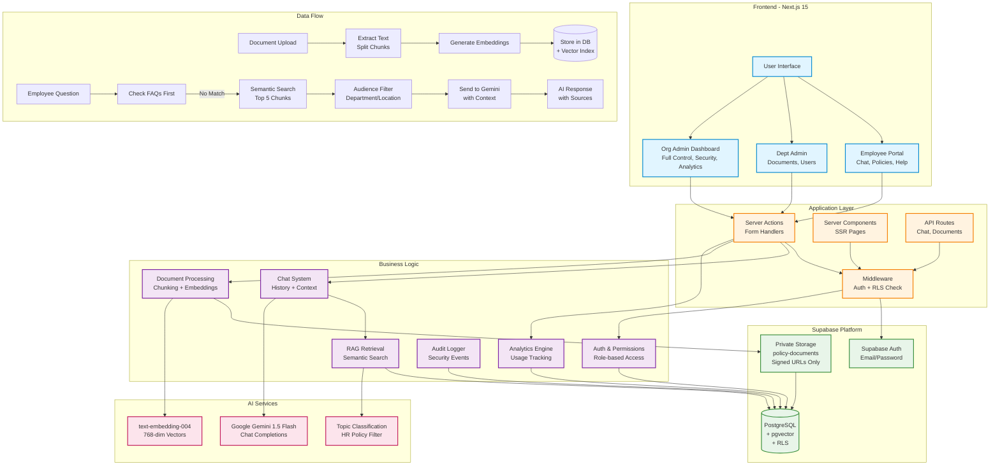

# 🏗️ PolicyPal AI Architecture

Complete system architecture documentation for PolicyPal AI.

---

## System Architecture Diagram



---

## Simplified Architecture

```
┌─────────────────────────────────────────────────────────────┐
│                      User Interface                         │
│  ┌──────────────┐  ┌──────────────┐  ┌──────────────┐     │
│  │   Employee   │  │  Dept Admin  │  │  Org Admin   │     │
│  │     Chat     │  │   Dashboard  │  │   Dashboard  │     │
│  └──────────────┘  └──────────────┘  └──────────────┘     │
└────────────┬──────────────┬──────────────┬─────────────────┘
             │              │              │
    ┌────────▼──────────────▼──────────────▼────────┐
    │         Next.js App Router                     │
    │  ┌────────┐ ┌────────┐ ┌────────┐            │
    │  │ Server │ │ Server │ │  API   │            │
    │  │ Actions│ │  Comp  │ │ Routes │            │
    │  └────────┘ └────────┘ └────────┘            │
    └────┬────────────┬────────────┬────────────────┘
         │            │            │
    ┌────▼────────────▼────────────▼────┐
    │      Supabase Platform             │
    │  ┌──────────┐  ┌──────────────┐   │
    │  │   Auth   │  │  PostgreSQL  │   │
    │  │ + RLS    │  │  + pgvector  │   │
    │  └──────────┘  └──────────────┘   │
    │  ┌──────────────────────────────┐ │
    │  │   Private Storage Bucket     │ │
    │  │   (Signed URLs only)         │ │
    │  └──────────────────────────────┘ │
    └────────────────┬───────────────────┘
                     │
            ┌────────▼────────┐
            │  Google Gemini  │
            │  (LLM + Embed)  │
            └─────────────────┘
```

---

## Data Flow

### Document Upload → AI Answers

**Complete Process:**

1. **Admin uploads PDF**
   - File validated (PDF only, max 10MB)
   - Uploaded to Supabase Storage (private bucket)
   - Metadata stored in `policy_documents` table

2. **System extracts text**
   - PDF parsed using `pdf-parse`
   - Text extracted page by page
   - Metadata preserved (page numbers, titles)

3. **Create chunks**
   - Text split into ~800-character chunks
   - Overlap of 200 characters for context
   - Chunks stored with document reference

4. **Generate vector embeddings**
   - Each chunk sent to Google `text-embedding-004`
   - Returns 768-dimensional vectors
   - Vectors stored in `policy_document_chunks` with pgvector

5. **Employee asks question**
   - Question text captured in chat interface
   - Rate limiting checked (20 questions/hour)
   - Audit log created

6. **Check HR-approved FAQs first**
   - Semantic search against `approved_faqs` table
   - Filtered by audience (department, location, employment type)
   - If match found (high similarity), return FAQ answer

7. **Semantic search finds relevant chunks**
   - Question converted to embedding (768-dim)
   - Cosine similarity search using pgvector
   - Returns top 5 most relevant chunks
   - Minimum similarity threshold applied

8. **Filter by audience**
   - Check chunk's document audience rules
   - Filter by employee's department
   - Filter by employee's location
   - Filter by employment_type
   - Only return chunks employee is allowed to see

9. **Send to Gemini as context**
   - Top 5 chunks concatenated (max 2000 chars each)
   - Question included in prompt
   - System instructions for HR context
   - Guardrails applied (HR policy topics only)

10. **Return AI answer with sources**
    - Gemini generates response
    - Source citations added (document names, page numbers)
    - Response stored in chat history
    - Analytics updated (usage metrics)

---

## Components

### Frontend Layer

**Next.js 15 App Router:**
- `/app/(auth)` - Login, register pages
- `/app/employee` - Employee portal (chat, policies)
- `/app/admin` - Admin dashboard (documents, users, analytics)

**Key Features:**
- Server-side rendering (SSR)
- Server Components by default
- Client Components for interactivity
- Middleware for auth checks

### Application Layer

**Server Actions:**
- Form submission handling
- Data mutations
- File uploads
- User management

**API Routes:**
- `/api/chat` - Chat completions
- `/api/admin/*` - Admin operations
- `/api/employee/*` - Employee operations

**Middleware:**
- Authentication checks
- RLS policy enforcement
- Route protection

### Business Logic

**Auth & Permissions** (`lib/auth/`)
- Role-based access control (RBAC)
- `canInviteRole()` - Role hierarchy
- `canManageDocuments()` - Document permissions
- `canViewSecurityDashboard()` - Security access

**Chat System** (`lib/chat/`)
- Chat history persistence
- Session management
- Message threading
- Context preservation

**Document Processing** (`lib/documents/`, `lib/processing/`)
- PDF parsing
- Text extraction
- Chunking algorithms
- Embedding generation
- Metadata extraction

**RAG Retrieval** (`lib/ai/`)
- Semantic search
- Vector similarity
- Audience filtering
- FAQ prioritization
- Context ranking

**Analytics** (`lib/analytics/`)
- Usage tracking
- Popular questions
- Document views
- User engagement metrics

**Audit Logging** (`lib/audit/`)
- Security events
- User actions
- System changes
- Compliance tracking

### Data Layer

**Supabase:**
- PostgreSQL database
- pgvector extension (vector search)
- Row Level Security (RLS)
- Real-time subscriptions
- Storage (private bucket)

**Key Tables:**
- `organizations` - Multi-tenant isolation
- `profiles` - User data with roles
- `policy_documents` - Document metadata
- `policy_document_chunks` - Text chunks with embeddings
- `chat_sessions` - Conversation threads
- `chat_messages` - Individual messages
- `approved_faqs` - HR-approved answers
- `audit_logs` - Security tracking
- `rate_limits` - Usage throttling

### AI Services

**Google Gemini:**
- Model: `gemini-1.5-flash`
- Chat completions
- Topic classification
- Guardrails enforcement

**Embeddings:**
- Model: `text-embedding-004`
- 768-dimensional vectors
- Used for both documents and queries
- Cosine similarity search

---

## Security Architecture

### Authentication Flow

```
1. User visits /login
2. Enter email/password
3. Supabase Auth validates
4. JWT token issued
5. Token stored in httpOnly cookie
6. Middleware validates on each request
7. RLS policies enforce data access
```

### Authorization Model

```
ORG_ADMIN
├── Full organizational control
├── Manage all users
├── Upload/manage documents
├── View security dashboard
├── Manage FAQs
└── Bypass audience restrictions

DEPARTMENT_ADMIN
├── Limited admin access
├── Can only invite EMPLOYEE role
├── Upload/manage documents
├── View limited audit logs
└── Bypass audience restrictions

EMPLOYEE
├── Chat interface only
├── Ask questions
├── View allowed documents
└── Filtered by audience targeting
```

### Document Security

1. **Private Bucket** - No public access
2. **Signed URLs** - 10-minute expiry
3. **Permission Checks** - Before URL generation
4. **Audience Filtering** - Department, location, employment type
5. **Audit Logging** - Track all access

### AI Security

1. **No Full PDFs** - Only 2000-char chunks sent to LLM
2. **Audience Filtering** - AI sees only allowed chunks
3. **Max 5 Chunks** - Per query
4. **FAQ Priority** - HR-approved answers first
5. **Rate Limiting** - 20 questions/hour
6. **Topic Guardrails** - HR policy topics only

---

## Scalability Considerations

### Current Design

- **Multi-tenant** - Organization-level isolation with RLS
- **Vector Search** - pgvector with HNSW index for fast similarity
- **Rate Limiting** - Per-user throttling
- **Caching** - FAQ results cached
- **Async Processing** - Document processing can be backgrounded

### Future Enhancements

- **Redis Caching** - Cache embeddings and frequent queries
- **Queue System** - Bull/BullMQ for document processing
- **CDN** - CloudFront for static assets
- **Read Replicas** - Supabase read replicas for analytics
- **Horizontal Scaling** - Vercel Edge Functions

---

## Technology Stack

### Frontend
- **Next.js 15** - App Router, Server Components
- **React 18** - UI library
- **Tailwind CSS** - Styling
- **shadcn/ui** - Component library
- **TypeScript** - Type safety

### Backend
- **Next.js API Routes** - REST endpoints
- **Supabase** - Backend-as-a-Service
- **PostgreSQL** - Primary database
- **pgvector** - Vector search extension

### AI/ML
- **Google Gemini 1.5 Flash** - LLM for chat
- **text-embedding-004** - Embedding model
- **pdf-parse** - PDF text extraction

### DevOps
- **Vercel** - Hosting and deployment
- **Git** - Version control
- **Playwright** - E2E testing
- **ESLint** - Code quality

---

## Related Documentation

- [Testing Guide](../TESTING_GUIDE_NEW.md)
- [Demo Videos](DEMO_VIDEOS.md)
- [Security Checklist](SECURITY_CHECKLIST.md)
- [Deployment Guide](DEPLOYMENT_CHECKLIST.md)
- [Project Structure](STRUCTURE.md)

---

**Last Updated:** 2026-07-12
